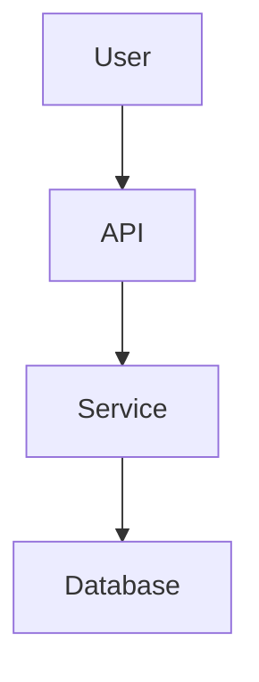

# Automatic Code Documentation with Ollama

 **Python tool** that scans a code repository, analyzes its structure, and uses a **local LLM (via Ollama)** to generate documentation.
It creates a `docs/README.md` file containing:

* High-level architecture overview
* Folder/module summaries
* Suggested **Mermaid.js diagrams**

---

## 🔹 Features

* Works fully **offline** with [Ollama](https://ollama.com/)
* Auto-generates Markdown docs inside `docs/README.md`
* Logs detailed steps and LLM outputs

---

## 🔹 Requirements

* **Python 3.9+**
* **Ollama** installed (Windows, macOS, Linux)
* At least one model pulled (e.g. `codellama:7b`)

---

## 🔹 Setup

1. Clone this repo or copy the script.
2. Pull a model for Ollama:

   ```powershell
   ollama pull codellama:7b #I have used 7b due to less GPU availability in my machine 
   ```
   *(other options: `deepseek-coder:6.7b`, `mistral:7b`)*
---

## 🔹 Usage
Run the script directly:
```powershell
python main.py
```

Output will be created at:
```
YourRepo/docs/README.md
```
---

## 🔹 Example Output (Mermaid Diagram)

---

## 🔹 GPU Notes (NVIDIA Users)

* If you have an NVIDIA GPU (like GTX 1650, RTX 3060, etc.), Ollama will try to use it.
* To check:
  ```powershell
  nvidia-smi
  ```
  Run it while Ollama is generating to confirm GPU memory usage.

* To force CPU:
  ```powershell
  $env:OLLAMA_NO_GPU=1
  ollama run codellama:7b
  ```

* To force GPU:
  ```powershell
  $env:OLLAMA_GPU=1
  ollama run codellama:7b
  ```
---


